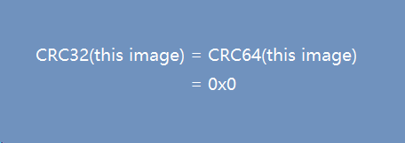
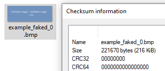

## CRCollider

*CRCollider* allows you to arbitrarily fake a file's CRC value.

For example, the following bitmap image has both its CRC32 and CRC64 value(calculated by 7-Zip) equal to zero, you can fake files like this on your own.





***Highlights about CRCollider***

- You can specify modifiable data at the **bit level**
- The size of bits modifiable can be fewer than the bit size of the target CRC value
- CRCollider outputs all possible solutions

Downsides

- Currently it works slowly for big files, I will try to find some time for the optimization

## Usage

The function ***collcrc*** inside `crcollider.py` gets all the job done:

```python
def collcrc(crc_func, sz: int, msg: bytes, ctr_bits: List[int], target_crc: int) -> Tuple[int, List[bytes]]:
    """
    Return value: (number_of_solutions, [solutions])\n
    Arguments:\n
    crc_func: the CRC function to be used\n
    sz: the bit size of the target CRC value\n
    msg: the message to perform CRC on\n
    ctr_bits: controllable bits in the message, e.g. [0,1,2,3,4,5,6,7] for the first byte\n
    target_crc: the target CRC value\n
    """
```

The usage is quite simple straightforward, you can check `example.py` for details.